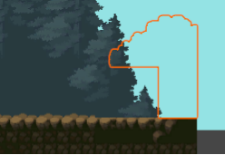

# Klezev Pad Kael
A fantastic game as a Student Project

# **Sujet :** 
En vous servant des deux premières pages de cours ("Découverte de Unity" et "la carte du jeu"), vous devriez être en capacité de créer la carte de votre jeu.

Le fichier attendu contiendra une description du jeu (niveau de jeu) que vous aimeriez mettre en place, ainsi que le descritif pas a pas de votre travail avec des explications, et un lien vers le git de votre projet ( optionnel ), le tout dans un fichier au format pdf.

Vous pouvez vous servir des fichiers que je vous ai fournis dans la page "Création d'un jeu 2D avec Unity" ou utiliser d'autre sprite et personnages que vous pourrez trouver sur internet.

## **1/ Description du jeu et de son univers**
Titre du jeu : ***Klezev Pad Kael** (L'Épée Éternelle de Kael – en Breton)* 

Pitch : Dans un monde mystique en ruines, où la magie et la technologie ancienne se sont effondrées, un jeune héros nommé Kael émerge du chaos. 
Il possède une caractéristique unique : une mèche de cheveux blanche, héritage d’un pouvoir ancien qui coule en lui. Armé de sa Lame Éternelle, une épée immense dotée de pouvoirs mystiques, Kael doit traverser des terres dévastées, peuplées de créatures oubliées et de pièges mortels.

Ce jeu de plateforme rétro à l’esthétique Pixel Art, notre héros explore des niveaux non linéaires mélant de l’adresse, de l’action et des Puzzles.

Sa lame se relève être son plus grand atout car elle révélera ses pouvoirs magiques tout au long des niveaux devenant l’élément central de sa quête.

Le cœur du jeu repose sur un système de combat fluide, où chaque coup est une danse entre attaque, esquive et contre-attaque. 
Kael peut également améliorer ses capacités au fil de l'aventure, en découvrant des reliques perdues qui renforceront la puissance de sa lame.

L’univers du jeu se veut mystérieux, pas d’indication de temporalité, mais des niveaux angoissant toujours à la limite du réel. On découvrira au fil du jeu l’histoire de notre héros et les raisons de sa présence ici.

La difficulté du jeu est elle aussi un hommage aux classiques des jeux de plateforme, ou la mémoire des joueurs est mis à rude épreuve afin de ne pas tomber dans les pièges du parcours. 
## **2/ Premier niveau : La forêt de l’oubli**
Le niveau s’ouvre sur Kael à coté d’une maison en rondin, armée de son épée, mais sans connaissance de ces pouvoir, il va devoir lutter contre les forces mystiques de la forêt afin de pouvoir s’en échapper.

Le premier niveau sert d’introduction au Gameplay, le joueur découvre les saut, les attaques simple, et l’environnement qui compose le jeu.

La forêt qui entoure Kael est pourvu d’une atmosphère mystique : 

\- Visuel : La forêt qui s’ouvre devant le Heros a une apparence normal, mais elle va devenir de plus en plus sombre au fil de son avancée pour déboucher sur une caverne qui entraînera notre héros vers d’autre aventure !

\- Monstres : Des animaux de la forêt envoûtés s’attaque à notre héros (phacochère / guepe)

\- Terrain : Des plateformes permettent au héros d’avancer dans la forêt envahis par moment par les flots.

## **3/ Recherche graphique**
En recherchant des assets pour le jeu, je suis tombé sur le travail de [@anokolisa](https://twitter.com/anokolisa) sur sa page itch.io qui proposait gratuitement un kit d’assets Legacy Fantasy en pixel Art 16x16 pour coller avec la consigne

Ce kit comprenaiit d’innombrable éléments de décor, un personnage principal et des monstres.

De quoi construire un niveau de la forêt complet avec ses personnages.

URL du kit : [https://anokolisa.itch.io/sidescroller-pixelart-sprites-asset-pack-forest-16x16]()

## **3/ Construction du niveau**
**Backgrounds** 

J’ai réalisé deux pattern d’arbres qui se répètent en alternant les couleurs

Ces patterns pourront être animé avec un effet de parrallax au déplacement du joueur

Sans personnage jouable, il est difficile de se rendre compte de l’impact de ces arbres monumental en arrière plan, un ajustement de la taille sera peut être nécessaire.

Un fond nuageux se répétent en arrère plan

**World & Parcours**

Le maptiles World permet d’établir un parcours pour notre personnage 

Ce parcours se compose de sauts, de plateformes, et d’eau

Les tailles et position seront à ajuster lors des phases de test de gameplay

L’eau devra être animé afin d’entrainer le jouer vers le bas

**Behind World / Between World & Front / Front world** 

Les calques de surface me permettent de réaliser des effets de chevauchement pour le joueur à passer derrière un élément du décor 

Comme ici avec ou sans le calque front, cela me permet de cacher astucieusement le changement de sol sans transition :) 

Ou encore ici, pour créer un effet d’entrée dans la grotte à la fin du niveau 

1/ World Only

2 / World + Front 

3/ Back + World + Front

